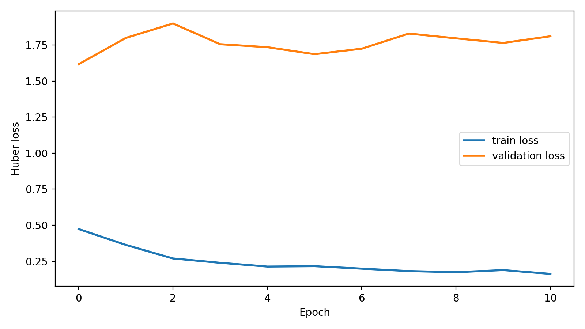
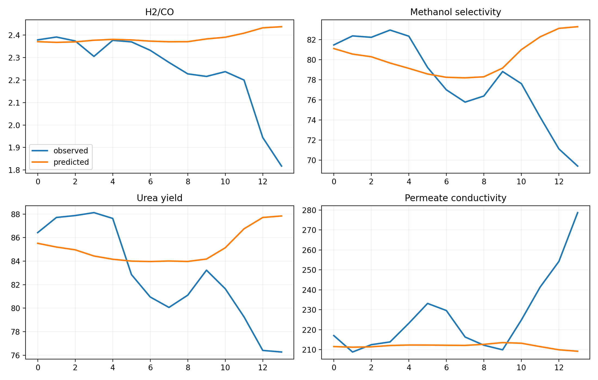

# hormuz-tectonochemical-engine


Reproducible hydrocarbon-nitrogen-water forecasting stack for the Strait of Hormuz problem, with an MCP-first surface and a paper-ready artifact pipeline.

Repository: [github.com/farukalpay/hormuz-tectonochemical-engine](https://github.com/farukalpay/hormuz-tectonochemical-engine)

Public MCP endpoint: `https://lightcap.ai/mcp/hormuz`

This repo is built for two readers at once:

- manuscript readers who want the equations, experiments, figures, and PDF in one place,
- MCP and agent users who want one useful call path before they care about internal plumbing.

## What You Get in 5 Minutes

- Apple Metal aware TensorFlow runtime detection with explicit CPU fallback,
- a 3-layer LSTM + temporal attention forecaster over aligned hydrocarbon / nitrogen / water observables,
- differentiable schedule optimization over the controllable process window,
- non-finite convergence guards with persistence fallback and explicit drift diagnostics,
- lab protocols with GC, FTIR, ion chromatography, yield, and conductivity targets,
- a single `scenario_briefing_tool` payload for MCP clients,
- a clean repo split: `paper/`, `code/`, `data/`, `results/`.

## Repo Layout

```text
paper/    manuscript source and compiled PDF
code/     package, MCP server, scripts, tests
data/     aligned benchmark data and source manifest
results/  model metrics, forecasts, optimization summaries, figures
```

## Fastest Install

Dry run:

```bash
python3 code/scripts/bootstrap_mcp_host.py --venv .venv-tf --dry-run
```

Apple Silicon install:

```bash
python3 code/scripts/bootstrap_mcp_host.py --venv .venv-tf
```

Then verify Metal / CPU fallback:

```bash
.venv-tf/bin/python code/scripts/check_tensorflow_backend.py
```

Then start the MCP server:

```bash
.venv-tf/bin/python -m mcp_server.server
```

Remote HTTP transport (public host):

```bash
HTE_MCP_TRANSPORT=streamable-http FASTMCP_HOST=0.0.0.0 FASTMCP_PORT=8000 .venv-tf/bin/python -m mcp_server.server
```

The default remains `stdio` when `HTE_MCP_TRANSPORT` is not set.

## Remote Deploy (Docker)

1. Keep your private server credentials in `.env` (already gitignored).
2. Shareable template for other users: `.env.example`.
3. Deploy with one command:

```bash
code/scripts/deploy_remote_mcp.sh
```

Template default endpoint path is `/mcp/hormuz` on the port in `HTE_REMOTE_MCP_PORT`.
FastMCP framework default remains `/mcp` when `FASTMCP_STREAMABLE_HTTP_PATH` is not set.
Container restart policy is `unless-stopped`, so it comes back after server reboot by default.

The Docker deploy auto-selects CPU, CUDA, or ROCm, keeps HTTP stateless by default, and retrains stale CPU fallback models when `GPU:0` becomes healthy. With `HTE_REQUIRE_GPU=true`, GPU-requested runs fail fast instead of silently falling back to `/CPU:0`.
Concurrency, OAuth, runtime image, and artifact publishing settings live in `.env` / `.env.example`.

## ChatGPT MCP Usage

No deploy is required for the hosted Lightcap server. Use this URL directly in ChatGPT MCP connector settings:

```text
https://lightcap.ai/mcp/hormuz
```

1. In ChatGPT, enable Developer mode if your plan or workspace requires it.
2. Open ChatGPT connector settings and add a remote MCP server.
3. Paste `https://lightcap.ai/mcp/hormuz`.
4. Approve the Hormuz consent screen.
5. Start a chat and ask the model to use the Hormuz MCP tools.

OpenAI's current docs describe custom MCP connectors under ChatGPT Developer mode and Apps & Connectors:
[Developer mode](https://developers.openai.com/api/docs/guides/developer-mode),
[Connectors in ChatGPT](https://help.openai.com/en/articles/11487775-connectors-in-chatgpt).

No password is required by default.
If `HTE_OAUTH_APPROVAL_PASSWORD_HASH` is set, the authorize page asks only that approval password.
Set `HTE_OAUTH_PUBLIC_BASE_URL=https://your-domain` so OAuth metadata always publishes HTTPS URLs.
`HTE_ARTIFACT_PUBLIC_BASE_URL` should also use `https://` for connector compatibility.
OAuth client registrations and refresh-token state are persisted at `HTE_OAUTH_STATE_FILE` (default: `/app/results/state/oauth_state.json`).
For long-lived connectors, keep `/app/results` on a persistent volume so `client_id` records survive container replacement.
Token lifetimes are tunable with `HTE_OAUTH_ACCESS_TOKEN_TTL_SECONDS`, `HTE_OAUTH_REFRESH_TOKEN_TTL_SECONDS`, and `HTE_OAUTH_AUTHORIZATION_CODE_TTL_SECONDS`.
Authorize UI endpoint (served from this stack): `https://lightcap.ai/mcp/hormuz/authorize`.
Generate a secure hash with:

```bash
python code/scripts/generate_oauth_approval_password_hash.py
```

Important: `https://lightcap.ai/mcp/nexus` is a different MCP gateway and has its own SSH-binding consent flow.

Need help connecting it to your own ChatGPT, Claude, or server? Email `alpay@lightcap.ai`; I am happy to help you get a clean run.

## Featured Prompt (ChatGPT / Claude)

Use this as a copy-paste starter prompt:

```text
Use the Hormuz MCP server at https://lightcap.ai/mcp/hormuz as an operational intelligence and model-execution copilot: scan only the latest 7 calendar days of high-credibility operational reporting about the Strait of Hormuz, Iran, Gulf energy, maritime transit, insurance, grid reliability, inspection access, feed gas, and desalination/process risk; discard opinion, duplicated headlines, market noise, and weak single-source speculation; for every retained source, call record_operational_evidence_tool with source_url, source_name, title, date, excerpt or summary, operational relevance, confidence, and mapped stress indices; infer conservative 0-1 scores for shipping_risk_index, insurance_spread_index, grid_stability_index, inspection_access_index, feed_gas_index, and chloride_load_index; then call backend_status_tool, alignment_manifest_tool, train_model_tool, forecast_observables_tool with steps=6, optimize_schedule_tool, and write_artifacts_tool; finish with a short executive decision brief in English, explicit uncertainty notes, the model-driven forecast and optimizer readout, and a compact JSON appendix with MCP actions and artifact references.
```

## Example Claude Run

Sample generated with Claude Sonnet 4.5 using the prompt above.

**Strait of Hormuz - Operational Intelligence Summary | 11 April 2026**

Current situation: The strait has been effectively closed since 28 February. Following the two-week ceasefire announced on 8 April, transit numbers have not increased; daily crossings sit at 3-15, negligible against the pre-war baseline of about 130. The IRGC controls the northern corridor, per-vessel transit fees exceed $1-2M, and coordination with Iran's Armed Forces is mandatory.

Critical stress points: Technically, coverage is available per the LMA, but Lloyd's premium rates are around 10%, equal to roughly $10-14M in additional war-risk cost for a single VLCC transit. The real blocker is crew safety, not insurance availability.

Qatar LNG: Two trains at Ras Laffan are damaged; 12.8 Mt/yr capacity is offline for 3-5 years per QatarEnergy's CEO. Shell and TotalEnergies have declared force majeure.

Decision action: Feed-gas constraints on the reforming process persist. The optimizer recommends raising the steam-to-carbon ratio to about 3.03 in the first two steps; this was a model-driven decision, not a manual one.

Drift warning: The inspection access score should be rechecked when fresh IAEA access reporting appears.

| Exogenous index | Score | Confidence | Operational readout |
| --- | ---: | ---: | --- |
| `shipping_risk_index` | 0.92 | 0.90 | Transits remain down more than 90% against pre-war baseline. |
| `insurance_spread_index` | 0.88 | 0.85 | War-risk pricing makes transit technically possible but operationally unattractive. |
| `grid_stability_index` | 0.48 | 0.62 | Regional power and desalination disruption is material but not catastrophic. |
| `inspection_access_index` | 0.12 | 0.70 | Safeguards access is treated as severely constrained until fresh IAEA confirmation. |
| `feed_gas_index` | 0.82 | 0.75 | LNG and gas infrastructure stress remains high but not total. |
| `chloride_load_index` | 0.38 | 0.55 | Conductivity stays mildly elevated, with limited direct chloride sensor evidence. |

| MCP output | Result |
| --- | --- |
| Backend | Requested GPU, resolved CPU for forecast/optimization on the hosted run. |
| Training | 11 epochs, mean test MAE 3.257, mean test RMSE 4.916. |
| Forecast | H2/CO moved from 2.437 at step 1 to 2.386 at step 6; urea yield moved from 87.84% to 84.70%. |
| Optimizer | Raised steam-to-carbon ratio to about 3.03 in early steps; final objective reached 0.235. |
| Artifact bundle | `artifact_index.json`, forecast JSON, optimization JSON, holdout predictions CSV, and two figures. |





## Artifact Links in MCP Responses

When a tool output contains file paths, MCP responses now include an `artifacts` section with:

- server storage paths,
- public paths,
- full URLs (if `HTE_ARTIFACT_PUBLIC_BASE_URL` is set).

Default public route:

```text
https://lightcap.ai/mcp/hormuz/artifacts/<run_id>/<relative_file_path>
```

You can disable public artifact links:

```bash
HTE_ARTIFACT_LINKS_ENABLED=false
```

## Request and Evidence Logging

The hosted server and Docker defaults keep durable MCP request records enabled.

- MCP tool request JSON is written under `results/audit/tool_requests/<date>/`.
- MCP tool result JSON is written under `results/audit/tool_results/<date>/`.
- Source-backed research evidence submitted by agents is written under `results/evidence/`.
- Secrets such as authorization headers, cookies, tokens, API keys, and passwords are redacted before writing.

For public operational workflows, agents should submit scraped or browsed source material with `record_operational_evidence_tool` before model execution. Every evidence item must include a source URL, so the final model run can be inspected later instead of becoming an unverifiable black box.
The project does not run retention cleanup on these folders; self-hosters should manage retention at the filesystem or backup-policy layer.

Self-hosters can disable or tune this behavior:

```bash
HTE_AUDIT_ENABLED=false
HTE_AUDIT_LOG_RESPONSES=false
HTE_AUDIT_MAX_STRING_LENGTH=20000
HTE_EVIDENCE_MAX_ITEMS=100
```

## Manual Install

Apple Silicon:

```bash
/opt/homebrew/bin/python3.11 -m venv .venv-tf
source .venv-tf/bin/activate
pip install -r code/requirements.txt
pip install -r code/requirements-tf-macos.txt
pip install -e './code[dev,tensorflow-apple]'
python code/scripts/check_tensorflow_backend.py
```

Linux / Windows:

```bash
python3 -m venv .venv-tf
source .venv-tf/bin/activate
pip install -r code/requirements.txt
pip install -r code/requirements-tf-linux-windows.txt
pip install -e './code[dev,tensorflow]'
python code/scripts/check_tensorflow_backend.py
```

## TensorFlow Policy

The numerical path is TensorFlow-first.

- If a TensorFlow GPU device is visible and a probe matmul succeeds, training runs on `GPU:0`.
- If TensorFlow imports but GPU runtime is missing or probe fails, the code records root-cause notes and reroutes training to CPU.
- If TensorFlow is missing, host diagnostics return an explicit install plan instead of silently switching to another framework.

## First Useful Commands

Generate the aligned benchmark dataset:

```bash
.venv-tf/bin/python code/scripts/generate_aligned_dataset.py
```

Rebuild the public artifacts:

```bash
.venv-tf/bin/python code/scripts/rebuild_outputs.py
```

Run the CLI directly:

```bash
.venv-tf/bin/python -m hte.cli rebuild --backend gpu --force-retrain
```

Inject stress-regime scenario rows (JSON list of partial/complete feature rows):

```bash
.venv-tf/bin/python -m hte.cli train --backend gpu --force-retrain --scenario-rows-json /path/to/scenario_rows.json
```

Host diagnostics:

```bash
.venv-tf/bin/python code/scripts/host_doctor.py
```

Tests:

```bash
.venv-tf/bin/python -m pytest code/tests/test_mcp_tools.py -q
```

## MCP Tools

Core surface:

- `backend_status_tool`
- `alignment_manifest_tool`
- `train_model_tool`
- `forecast_observables_tool`
- `optimize_schedule_tool`
- `validation_protocols_tool`
- `write_artifacts_tool`
- `scenario_briefing_tool`
- `record_operational_evidence_tool`
- `host_diagnostics_tool`

`scenario_briefing_tool` is the shortest path from zero to a full payload with backend status, provenance, and generated artifact references.
For source-backed intelligence workflows, call `record_operational_evidence_tool` before model execution so every retained source has a durable JSON record with its source URL.

## Generated Artifacts

Main files produced by the default run:

- `results/model_metrics_lb12_hz1_u128-96-64.json`
- `results/holdout_predictions_lb12_hz1_u128-96-64.csv`
- `results/horizon_forecast_lb12_hz1_u128-96-64.json`
- `results/optimization_summary_lb12_hz1_u128-96-64.json`
- `results/validation_protocols_lb12_hz1_u128-96-64.json`
- `results/figures/holdout_forecast_lb12_hz1_u128-96-64.png`
- `results/figures/optimized_control_schedule_lb12_hz1_u128-96-64.png`
- `paper/paper.pdf`

## Docker

Build:

```bash
docker build -t hte-mcp .
```

Run:

```bash
docker run --rm -it -p 8000:8000 hte-mcp
```

With this repo defaults, use `http://localhost:8000/mcp/hormuz`.
If `FASTMCP_STREAMABLE_HTTP_PATH` is unset, FastMCP default is `http://localhost:8000/mcp`.

## Citation Bridge

- Software metadata: `CITATION.cff`
- License: `LICENSE`
- Manuscript source: `paper/paper.tex`
- Data/source manifest: `data/source_manifest.json`
